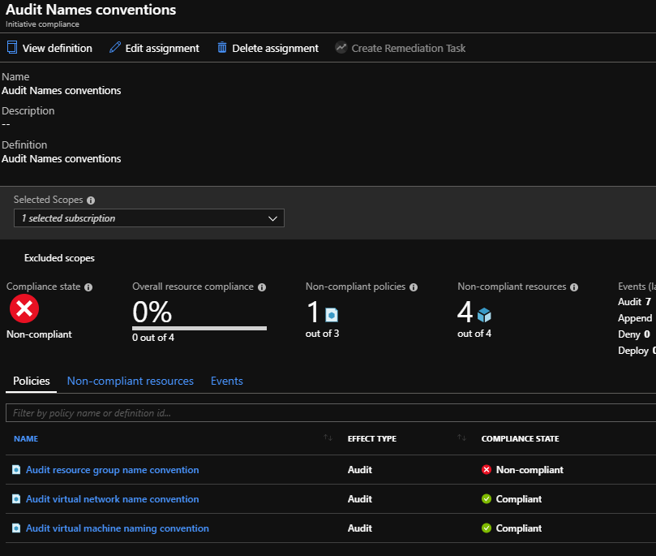
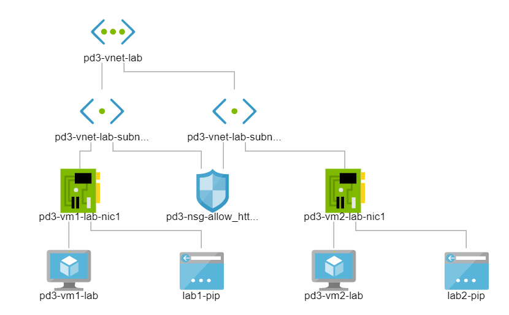
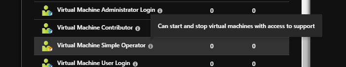

# Zadanie 3.1

## Konwencje nazewnicze:

### Ogólne reguły

> Nazwy zasobów piszemy z małych liter i po angielsku. Nazwa powinna być krótka ale opisowa. Dla każdego projektu budowanego w oparciu o Microsoft Azure, należy określić krótki prefiks, który będzie rozpoczynał nazwę każdego definiowanego zasobu w Microsoft Azure.

Prefiks może się składać z cyfr i liter a jego minimalna długość to 2 a maksymalna 3.

> Na potrzeby tego dokumentu przyjmujemy prefiks: **pd3** dla projektu Praca Domowa nr. 3.

Stosowane skróty dla regionów:
- North Europe - ne
- West Europe - we
- France Central - fc
- France South - fs
- UK West - uw
- UK South - us
- Germany Central - gc
- Germany Northeast - gne
- Germany North - gn
- Germany West Central - gwc
- Switzerland North - sn
- Switzerland West - sw
- Norway East - nye
- Norway West - nyw

Stosowane skróty dla środowisk:
- prod - środowisko produkcyjne
- dev - środowisko deweloperskie
- qa - środowisko testowe


### Zasady dla poszczególnych zasobów:


**Grupa zasobów**

`<prefix>-rg-<region>-<environment>-<nazwa>`
- długość pola nazwa: 3-60 znaków
- dozwolone znaki: litery, cyfry, podkreślenie, myślnik
- nazwa powinna być krótka i odnosić się do przeznaczenia danej grupy zasobów


**Maszyna wirtualna**

`<prefix>-vm<number>-[region]-<nazwa>`
- długość maksymalna: 15 (Windows), 17 (Linux)
- długość pola nazwa: 2-3 (Windows), 2-5 (Linux)
- pole number może przyjmować wartości od 1 do 9
- region:wymagane w przypadku, gdy zasób należy do innego regionu niż grupa robocza do którego został przypisany
- dozwolone znaki: litery, cyfry, podkreślenie, myślnik
- nazwa powinna być krótka i odnosić się do przeznaczenia/roli danej maszyny wirtualnej


**Wirtualne sieci**

`<prefix>-vnet-[region]-<nazwa>`
- długość pola nazwa: 2-50 
- region:wymagane w przypadku, gdy zasób należy do innego regionu niż grupa - - - robocza do którego został przypisany
- dozwolone znaki: litery, cyfry, podkreślenie, myślnik
- nazwa powinna być krótka i odnosić się do przeznaczenia danej sieci wirtualnej


**Podsieci**

`<nazwa wirtualnej sieci>-subnet<number>-name`
- długość pola nazwa: 2-7
- pole number może przyjmować wartości od 1 do 99, przy czym wartości poniżej 10 - zapisywane muszą być z poprzedzającym zerem, np. 01
- dozwolone znaki: litery, cyfry, podkreślenie, myślnik
nazwa powinna być krótka i odnosić się do przeznaczenia danej podsieci


**Karta sieciowa**

`<nazwa wirtualnej maszyny>-nic<number>`
- maksymalna długość: 80
- pole number może przyjmować wartości od 1 do 9


**Sieciowa grupa zabezpieczeń**

`<prefix>-nsg-<nazwa>`
- długość pola nazwa: 2-70
- dozwolone znaki: litery, cyfry, podkreślenie, myślnik
- nazwa powinna być krótka i odnosić się do przeznaczenia grupy zabezpieczeń


**Dysk**

`<nazwa wirtualnej maszyny>-osdisk`
- maksymalna długość: 24


**Konto składowania danych**

`<prefix>sa<globalnie unikalna nazwa>`
- maksymalna długość: 24
- należy użyć funkcji do wygenerowania unikalnej nazwy


**Publiczny adres ip**

`<nazwa>-pip`
- długość pola nazwa: 2-40
- nazwa powinna zawierać nazwę maszyny wirtualnej lub innego zasobu/usługi do którego zostanie przypisany publiczny adres ip


> Kilka reguł zostało częściowo zdefiniowanych przy pomozy Azure Policy. Przykładowe definicje polityk znajdują się w [policy](/policy)

Na podstawie przykładowych polityk zbudowałem inicjatywe Audit Naming conventions ale wymaga ona jeszcze dopracowania jak i same polityki.




# Zadanie 3.2

 Deploy szablonu arm do grupy zasobów z dwoma maszynami wirtualnymi w różnych subnetach w tym samym vnecie z wykorzystaniem Linked Template. Dodatkowow do obu maszyn wirtualnych został podpięty publiczny adres ip,
 aby można było testowo dostać się na maszynę. Podczas deployu została stworzono Network Security Group pozwalająca na ruch po http i po ssh.

 Główny plik szablonu zlokalizowany jest w [arm-templates/azure-deploy-ubuntu.nested.json](arm-templates/azure-deploy-ubuntu.nested.json). Wszystkie połączone szablony zlokalizowane są w
 `arm-templates/shared`.

 Deploy z użyciem auzre cli:

 ```
 az group deployment create  --query [properties.outputs.sshCommandLab1.value,properties.outputs.sshCommandLab2.value]  --resource-group pd3-rg-we-dev-lab --name zad3.2 --template-file arm-templates/azure-deploy-ubuntu.nested.json --parameters arm-templates/azure-deploy-ubuntu.parameters.nested.json
 ```

 Powstała sieć:
 


> Komendy do uruchomienia znajdują się w pliku [deploy.azcli](deploy.azcli)

# Zadanie 3.3

Miało być najprostsze zadanie :-), ale już na samym początku pojawił się problem. 
Próba zdeployowania prostej roli zdefiniowanje w pliku [rbac/vm-simple-operartor.json](rbac/vm-simple-operator.json), zakończyła się błędem.

```
The client 'live.com#lukaszewczak@outlook.com' with object id 'f3' does not have authorization to perform action 'Microsoft.Authorization/roleDefinitions/write' over scope '/providers/Microsoft.Authorization/roleDefinitions/50'
```

Okazuje się, że jestem globalnym administratorem w Azure Ad a mimo to nie mam uprawnień potrzebnych do zarządzania sybksrybcją. Na szczęście na podstawie artykułu [https://docs.microsoft.com/en-us/azure/role-based-access-control/elevate-access-global-admin](https://docs.microsoft.com/en-us/azure/role-based-access-control/elevate-access-global-admin), dowiedziałem się że uprawnienia Azure Ad i rbac to troche co innego i również to, że mogę je podnieść. 

Po podniesieniu uprawnienień deploy własnej roli rbac powiódł się:-). 

Komedna do doployu

```
az role definition create --role-definition rbac/vm-simple-operator.json
```

> Przed deployem, należy podać w pliku definicji roli rbac **id subskrybcji**


Po deployu, rola widoczna jest na poziomie sybksrybcji 



# Zadanie 3.4

Deploy takiej samej sieci jak w zadaniu 3.2 tylko przy uzyciu Azure Key Vault do przechowania nazwy użytkownika i hasła.

Na początek tworzymy Key Vault

```
# Tworze grupe robocza dla key vault
az group create --name sec-rg-we-dev-key_vault --location westeurope

# Tworze key vault
az keyvault create --resource-group sec-rg-we-dev-key_vault --name arm-lab-key-vault --location westeurope --enabled-for-template-deployment true


# Dodaj haslo i nazwe uzytkownika do key vault
az keyvault secret set --vault-name arm-lab-key-vault --name adminPassword --value pA$$w0rd
az keyvault secret set --vault-name arm-lab-key-vault --name adminUsername --value lukaszs

```

Następnie deploy z podobną komendą jak w zadaniu 3.2 z tą różnicą, że przekazujemy inny plik z parametrami,
w którym zamiast jawnie podawać hasło i użytkownika odwołujemy się do Key Vaulta

```

        "adminUsername": {
            "reference": {
                "keyVault": {
                    "id": "/subscriptions/<SUBSCRIPTION_ID>/resourceGroups/sec-rg-we-dev-key_vault/providers/Microsoft.KeyVault/vaults/arm-lab-key-vault"
                },
                "secretName": "adminUsername"
            }
        },
        "adminPassword": {
            "reference": {
                "keyVault": {
                    "id": "/subscriptions/<SUBSCRIPTION_ID>/resourceGroups/sec-rg-we-dev-key_vault/providers/Microsoft.KeyVault/vaults/arm-lab-key-vault"
                },
                "secretName": "adminPassword"
            }
        },
```

> Przed deployem należy zmienić SUBSCRIPTION_ID